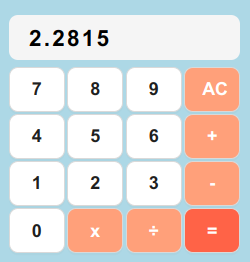
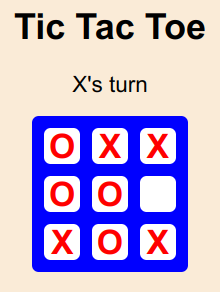
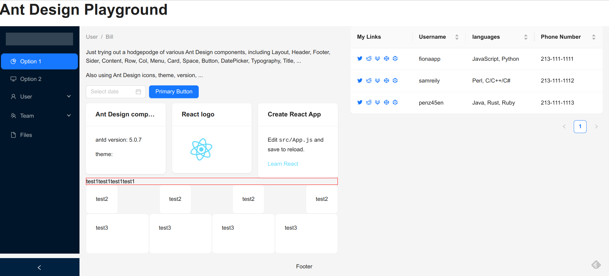

# react-learn
Some projects I made to practice React, Redux, Ant Design, and styled-components.  There's a calculator, tic tac toe game, Ant Design Playground, business website form, and coursework.

#### Click on the picture or link to go to the featured React project.

[Calculator](meta-w4/)

[Tic Tac Toe game](tic-tac-toe/)

[Ant Design Components in a React App](ant/)
